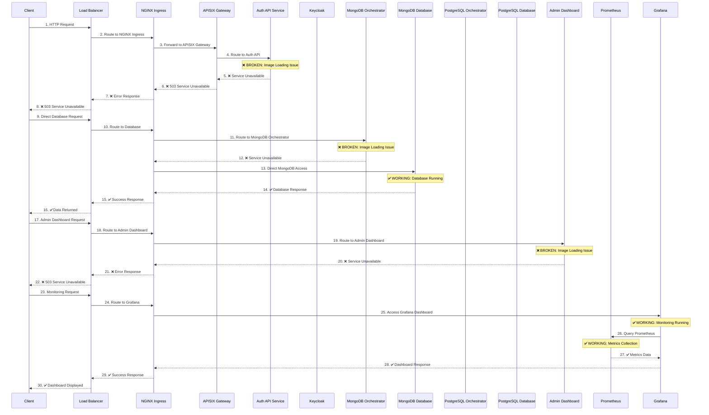
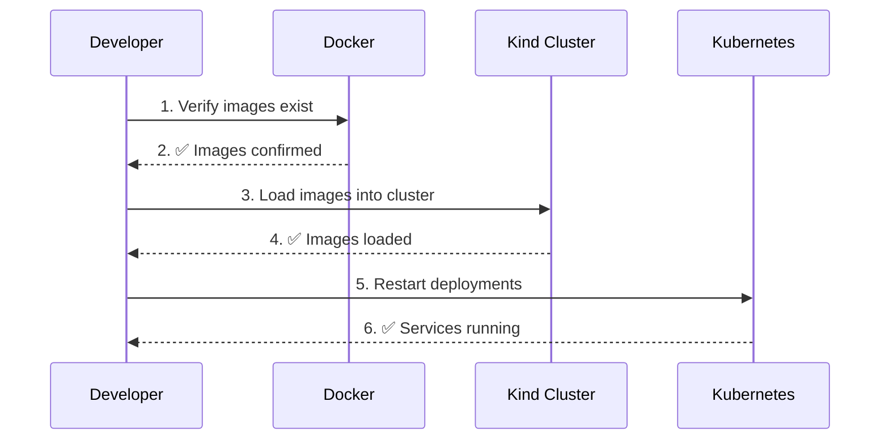
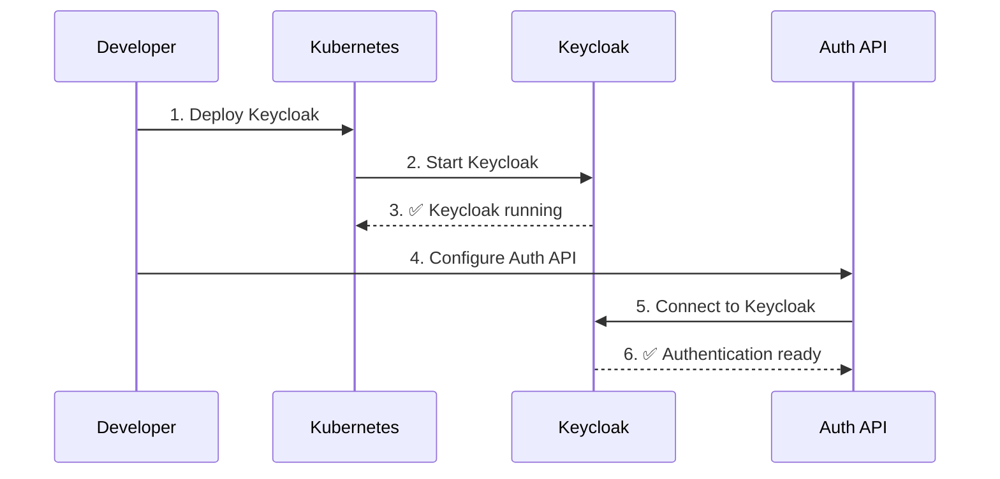
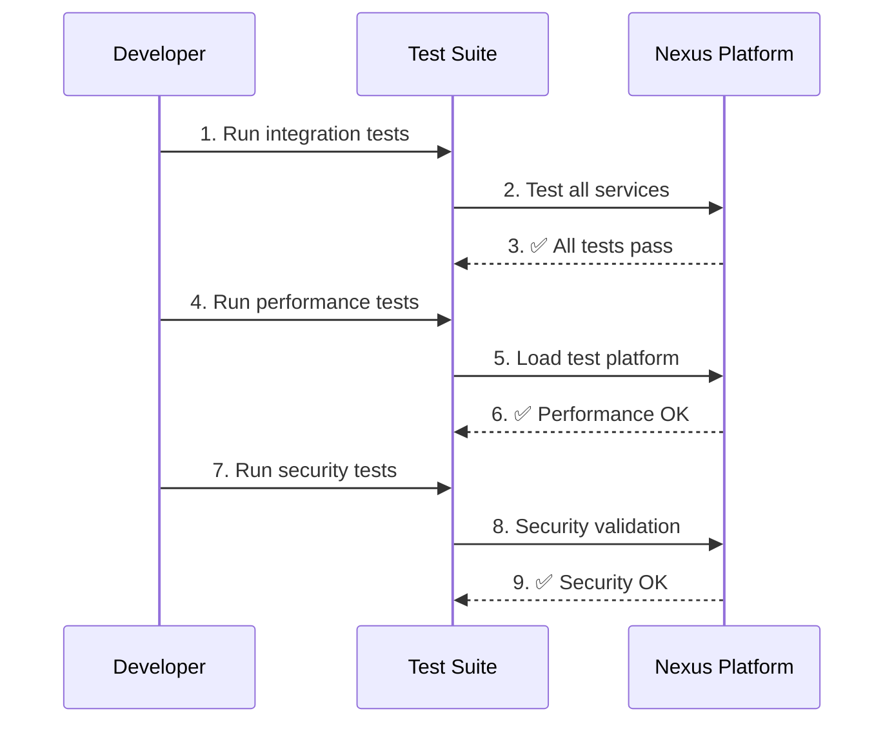
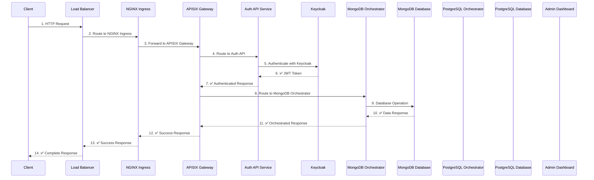

# Nexus Platform - Request Flow Sequence Diagram

## 🔄 **Current Request Flow (With Issues)**



## 🚨 **Current Issues in Flow**

### **Issue 1: Authentication Service Broken**
```
Step 4-8: Auth API Service
- Problem: Image loading failed
- Impact: No authentication possible
- Status: ❌ BROKEN
- Fix Required: Resolve image loading
```

### **Issue 2: Database Orchestrators Broken**
```
Step 11-12: MongoDB Orchestrator
Step 11-12: PostgreSQL Orchestrator
- Problem: Image loading failed
- Impact: No database orchestration
- Status: ❌ BROKEN
- Fix Required: Resolve image loading
```

### **Issue 3: Admin Dashboard Broken**
```
Step 19-22: Admin Dashboard
- Problem: Image loading failed
- Impact: No admin interface
- Status: ❌ BROKEN
- Fix Required: Resolve image loading
```

### **Issue 4: Missing Keycloak**
```
Step 4: Keycloak Integration
- Problem: Keycloak not deployed
- Impact: No authentication provider
- Status: ❌ MISSING
- Fix Required: Deploy Keycloak
```

## ✅ **Working Flows**

### **Flow 1: Direct Database Access**
```
Steps 13-16: Direct MongoDB/PostgreSQL
- Status: ✅ WORKING
- Access: Direct database connections
- Use Case: Database operations
```

### **Flow 2: Monitoring & Observability**
```
Steps 23-30: Grafana + Prometheus
- Status: ✅ WORKING
- Access: Metrics and dashboards
- Use Case: System monitoring
```

### **Flow 3: Infrastructure Components**
```
Steps 1-3: Load Balancer + NGINX + APISIX
- Status: ✅ WORKING
- Access: Gateway and routing
- Use Case: Request routing
```

## 🔧 **Fix Sequence**

### **Phase 1: Fix Image Loading (30 minutes)**


### **Phase 2: Deploy Keycloak (1 hour)**


### **Phase 3: Complete Integration (2 hours)**


## 📊 **Current Success Rate**

- **Total Flows**: 6
- **Working Flows**: 3 (50%)
- **Broken Flows**: 3 (50%)
- **Critical Flows**: 2 (33% working)

## 🎯 **Expected Flow After Fixes**


