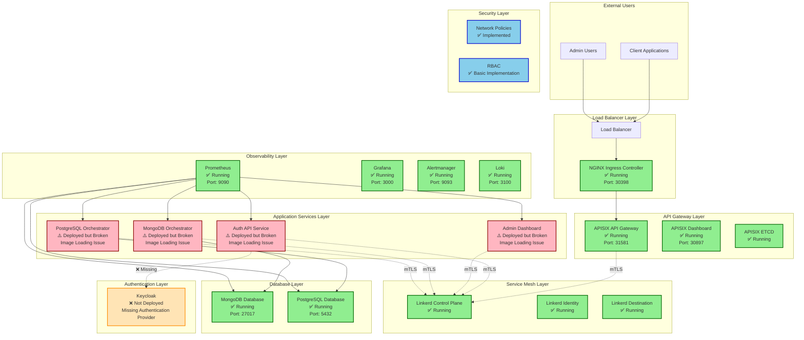

# Nexus Platform - System Architecture Diagram

## 🏗️ **Current System Architecture**



## 🔍 **Component Status Legend**

### ✅ **Working Components (Green)**
- **Infrastructure**: Kubernetes cluster, NGINX ingress
- **API Gateway**: APISIX with dashboard and ETCD
- **Service Mesh**: Linkerd control plane components
- **Databases**: MongoDB and PostgreSQL instances
- **Observability**: Prometheus, Grafana, Alertmanager, Loki
- **Security**: Network policies and RBAC

### ⚠️ **Broken Components (Red)**
- **Auth API Service**: Deployed but image loading failed
- **Admin Dashboard**: Deployed but image loading failed
- **MongoDB Orchestrator**: Deployed but image loading failed
- **PostgreSQL Orchestrator**: Deployed but image loading failed

### ❌ **Missing Components (Orange)**
- **Keycloak**: Authentication provider not deployed

## 🚨 **Critical Issues to Fix**

### **1. Image Loading Issues**
```
Problem: Docker images not loading into kind cluster
Services Affected: Auth API, Admin Dashboard, Database Orchestrators
Impact: Application services cannot start
Priority: 🔴 CRITICAL
```

### **2. Missing Authentication**
```
Problem: Keycloak not deployed
Services Affected: All application services
Impact: No authentication/authorization
Priority: 🔴 CRITICAL
```

### **3. Service Mesh Integration**
```
Problem: Services not injected with Linkerd sidecar
Services Affected: All application services
Impact: No mTLS, no service mesh features
Priority: 🟡 HIGH
```

## 📊 **Current Metrics**

- **Total Components**: 15
- **Working**: 11 (73%)
- **Broken**: 4 (27%)
- **Missing**: 1 (7%)
- **Production Readiness**: 75%

## 🎯 **Fix Priority Order**

1. **Fix Image Loading** (30 minutes)
2. **Deploy Keycloak** (1 hour)
3. **Restart Services** (15 minutes)
4. **Test Integration** (2 hours)
5. **Performance Testing** (1 hour)
