# Nexus Platform - Troubleshooting & Fix Flowchart

## 🔧 **Current Issues & Fix Process**

```mermaid
flowchart TD
    Start([Start: Nexus Platform Issues]) --> CheckStatus{Check Current Status}
    
    CheckStatus --> Infrastructure{Infrastructure Status}
    Infrastructure -->|✅ Working| Services{Application Services}
    Infrastructure -->|❌ Broken| FixInfra[Fix Infrastructure]
    FixInfra --> Services
    
    Services --> AuthAPI{Auth API Service}
    AuthAPI -->|❌ Image Loading Issue| FixAuthImage[Fix Auth API Image Loading]
    AuthAPI -->|✅ Working| AdminDash{Admin Dashboard}
    
    FixAuthImage --> LoadAuthImage[Load Auth API Image into Kind]
    LoadAuthImage --> RestartAuth[Restart Auth API Deployment]
    RestartAuth --> AdminDash
    
    AdminDash -->|❌ Image Loading Issue| FixAdminImage[Fix Admin Dashboard Image Loading]
    AdminDash -->|✅ Working| MongoOrch{MongoDB Orchestrator}
    
    FixAdminImage --> LoadAdminImage[Load Admin Dashboard Image into Kind]
    LoadAdminImage --> RestartAdmin[Restart Admin Dashboard Deployment]
    RestartAdmin --> MongoOrch
    
    MongoOrch -->|❌ Image Loading Issue| FixMongoImage[Fix MongoDB Orchestrator Image Loading]
    MongoOrch -->|✅ Working| PostgresOrch{PostgreSQL Orchestrator}
    
    FixMongoImage --> LoadMongoImage[Load MongoDB Orchestrator Image into Kind]
    LoadMongoImage --> RestartMongo[Restart MongoDB Orchestrator Deployment]
    RestartMongo --> PostgresOrch
    
    PostgresOrch -->|❌ Image Loading Issue| FixPostgresImage[Fix PostgreSQL Orchestrator Image Loading]
    PostgresOrch -->|✅ Working| Keycloak{Keycloak Deployed}
    
    FixPostgresImage --> LoadPostgresImage[Load PostgreSQL Orchestrator Image into Kind]
    LoadPostgresImage --> RestartPostgres[Restart PostgreSQL Orchestrator Deployment]
    RestartPostgres --> Keycloak
    
    Keycloak -->|❌ Not Deployed| DeployKeycloak[Deploy Keycloak]
    Keycloak -->|✅ Working| ServiceMesh{Service Mesh Integration}
    
    DeployKeycloak --> SetupKeycloak[Setup Keycloak Configuration]
    SetupKeycloak --> ConfigureAuth[Configure Auth API for Keycloak]
    ConfigureAuth --> ServiceMesh
    
    ServiceMesh -->|❌ Not Integrated| FixServiceMesh[Fix Service Mesh Integration]
    ServiceMesh -->|✅ Working| IntegrationTests{Integration Tests}
    
    FixServiceMesh --> InjectSidecars[Inject Linkerd Sidecars]
    InjectSidecars --> VerifyMTLS[Verify mTLS Communication]
    VerifyMTLS --> IntegrationTests
    
    IntegrationTests -->|❌ Tests Fail| FixTests[Fix Integration Issues]
    IntegrationTests -->|✅ All Pass| PerformanceTests{Performance Tests}
    
    FixTests --> DebugIssues[Debug Integration Issues]
    DebugIssues --> RetryTests[Retry Integration Tests]
    RetryTests --> IntegrationTests
    
    PerformanceTests -->|❌ Performance Issues| OptimizePerformance[Optimize Performance]
    PerformanceTests -->|✅ Performance OK| SecurityTests{Security Tests}
    
    OptimizePerformance --> TuneServices[Tune Service Resources]
    TuneServices --> RetryPerf[Retry Performance Tests]
    RetryPerf --> PerformanceTests
    
    SecurityTests -->|❌ Security Issues| FixSecurity[Fix Security Issues]
    SecurityTests -->|✅ Security OK| ProductionReady{Production Ready?}
    
    FixSecurity --> UpdatePolicies[Update Security Policies]
    UpdatePolicies --> RetrySecurity[Retry Security Tests]
    RetrySecurity --> SecurityTests
    
    ProductionReady -->|❌ Not Ready| IdentifyGaps[Identify Remaining Gaps]
    ProductionReady -->|✅ Ready| DeployProduction[Deploy to Production]
    
    IdentifyGaps --> UpdatePlan[Update Fix Plan]
    UpdatePlan --> CheckStatus
    
    DeployProduction --> Success([🎉 Production Deployment Complete!])
    
    %% Styling
    classDef working fill:#90EE90,stroke:#006400,stroke-width:2px
    classDef broken fill:#FFB6C1,stroke:#8B0000,stroke-width:2px
    classDef fix fill:#FFE4B5,stroke:#FF8C00,stroke-width:2px
    classDef success fill:#87CEEB,stroke:#0000CD,stroke-width:2px
    
    class Infrastructure,Services,AuthAPI,AdminDash,MongoOrch,PostgresOrch,Keycloak,ServiceMesh,IntegrationTests,PerformanceTests,SecurityTests,ProductionReady working
    class FixInfra,FixAuthImage,FixAdminImage,FixMongoImage,FixPostgresImage,DeployKeycloak,FixServiceMesh,FixTests,OptimizePerformance,FixSecurity,IdentifyGaps broken
    class LoadAuthImage,RestartAuth,LoadAdminImage,RestartAdmin,LoadMongoImage,RestartMongo,LoadPostgresImage,RestartPostgres,SetupKeycloak,ConfigureAuth,InjectSidecars,VerifyMTLS,DebugIssues,RetryTests,TuneServices,RetryPerf,UpdatePolicies,RetrySecurity,UpdatePlan fix
    class Success success
```



## 🚨 **Current Critical Issues**

### **Issue 1: Image Loading Problems**
```
Problem: Docker images not loading into kind cluster
Affected Services:
- Auth API Service
- Admin Dashboard
- MongoDB Orchestrator
- PostgreSQL Orchestrator

Root Cause: Kind cluster image loading mechanism
Impact: Application services cannot start
Priority: 🔴 CRITICAL
```

### **Issue 2: Missing Authentication**
```
Problem: Keycloak not deployed
Affected Services: All application services
Root Cause: Authentication provider missing
Impact: No authentication/authorization
Priority: 🔴 CRITICAL
```

### **Issue 3: Service Mesh Integration**
```
Problem: Services not injected with Linkerd sidecar
Affected Services: All application services
Root Cause: Service mesh not properly configured
Impact: No mTLS, no service mesh features
Priority: 🟡 HIGH
```

## 🔧 **Fix Commands & Steps**

### **Step 1: Fix Image Loading**
```bash
# 1. Verify images exist locally
docker images | grep nexus

# 2. Load images into kind cluster
kind load docker-image --name nexus-dev nexus/auth-api:latest
kind load docker-image --name nexus-dev nexus/admin-dashboard:latest
kind load docker-image --name nexus-dev nexus/mongodb-orchestrator:latest
kind load docker-image --name nexus-dev nexus/postgresql-orchestrator:latest

# 3. Verify images in cluster
docker exec nexus-dev-control-plane ctr images ls | grep nexus

# 4. Restart deployments
kubectl delete pods -l app=auth-api-service
kubectl delete pods -l app=admin-dashboard
kubectl delete pods -l app=mongodb-orchestrator
kubectl delete pods -l app=postgresql-orchestrator
```

### **Step 2: Deploy Keycloak**
```bash
# 1. Deploy Keycloak
kubectl apply -f iac/kubernetes/keycloak-deployment.yaml

# 2. Configure Keycloak
kubectl exec -it deployment/keycloak -- /opt/keycloak/bin/kc.sh config

# 3. Setup realm and clients
kubectl apply -f iac/kubernetes/keycloak-config.yaml
```

### **Step 3: Fix Service Mesh**
```bash
# 1. Verify Linkerd is running
linkerd check

# 2. Inject sidecars into existing deployments
kubectl get deployment -o yaml | linkerd inject - | kubectl apply -f -

# 3. Verify sidecar injection
kubectl get pods -o jsonpath='{.items[*].spec.containers[*].name}' | grep linkerd-proxy
```

### **Step 4: Run Tests**
```bash
# 1. Integration tests
./scripts/run-integration-tests.sh

# 2. Performance tests
k6 run scripts/k6-performance-test.js

# 3. Contract tests
npm test scripts/pact-contract-testing.js
```

## 📊 **Progress Tracking**

### **Current Status**
- **Total Issues**: 3
- **Critical Issues**: 2
- **High Priority Issues**: 1
- **Estimated Fix Time**: 4-6 hours

### **Success Criteria**
- [ ] All application services running
- [ ] Keycloak deployed and configured
- [ ] Service mesh integration complete
- [ ] All integration tests passing
- [ ] Performance tests meeting thresholds
- [ ] Security tests passing

## 🎯 **Next Steps**

1. **Immediate (30 minutes)**: Fix image loading issues
2. **Short-term (1 hour)**: Deploy and configure Keycloak
3. **Medium-term (2 hours)**: Complete service mesh integration
4. **Long-term (2 hours)**: Run comprehensive testing suite

## 🔄 **Update Process**

As we fix each issue, we'll update the diagrams to reflect the current state:

1. **System Architecture**: Update component status (❌ → ⚠️ → ✅)
2. **Sequence Flow**: Update broken flows to working flows
3. **Troubleshooting Flowchart**: Mark completed fixes as resolved

This will give us a clear visual representation of our progress and remaining work.
